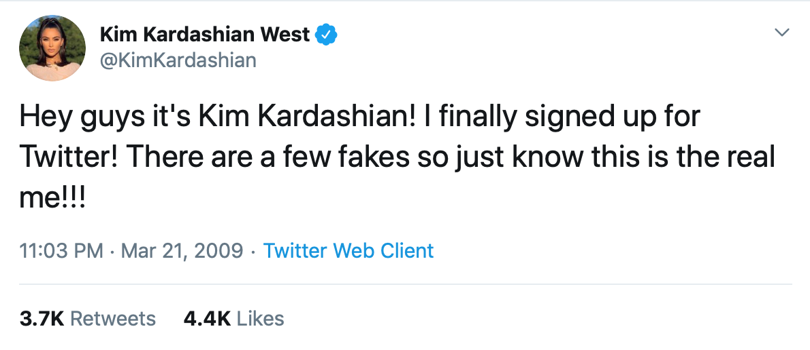

### Previously on Keeping up with the Kardashians:

This is a Jupyter notebook compiling information on Kim Kardashian's twitter activities. It's very much an ongoing project.

<b>Downloading Kim's entire twitter history:</b>

Since the Twitter API only allows for the scraping of the last ~3500 or so tweets, Python's "Get Old Tweets" module was used to to download all of Kim's tweets and save them to a csv file:

<hr>

`tweet_grabber.py` contains the grab_all_tweets function with which a user's twitter timeline can be downloaded entirely or in parts.

Creating a new csv file with all available tweets:

```python
grab_all_tweets(usr_name='KimKardashian', n=0, 
                filename='allkim.csv', mode='w')
```

Appending new tweets to the file:

```python
grab_all_tweets(usr_name='KimKardashian', n=0, 
                filename='allkim.csv', mode='a', 
                date_since="2019-07-22")
```
<hr>

This gold mine gives us access to ALL of Kim's tweets since the inception of her Twitter account on March 21st, 2009 when she tweeted:



A true legend. 